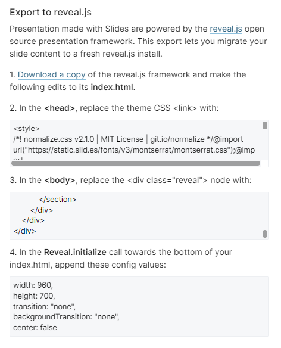

# reveal.js mit angepasstem Theme in IKS-Optik

[Link zur Offiziellen Seite](https://revealjs.com/)
[Link zum Online-Editor](https://slides.com/)

# Benutzung

Das gebaute Theme liegt in `revealjs/dist/theme/iks-theme.css` und kann in existierende revealjs-Präsentationen eingebunden werden.

## Theme neu bauen

1. Anpassungen in `revealjs/theme/iks-theme.scss` vornehmen
2. Theme mithilfe von `gulp css` neu bauen
   - Das gebaute Theme landet zusammen mit den weiteren Assets (Firmenlogo, Splashimage) in `revealjs/dist/theme/`

## Nutzung von `Slides.com` zum Erstellen von Präsentationen

Statt die Präsentation eigenhändig im Markdown/HTML zu erstellen kann auch der offizielle [Online-Editor](https://slides.com/) genutzt werden.

1. Kopie der `index.html` anlegen
2. Dann die erstellen Slides im Editor auswählen -> Export (Cloud-Symbol) -> Export to reveal.js auswählen
3. Die Inhalte der Textboxen entsprechend der Bildanleitung in die passenden Abschnitte der kopierten `index.html` kopieren

## Export als PDF (funktioniert aktuell nur im Google Chrome)

1. Präsentation öffnen (`.html` im Browser öffnen oder Liveserver starten per `npm start` bzw. `gulp serve`)
2. `?print-pdf` an URL anfügen, dies erzeugt die "Druckansicht" der Präsentation
3. Drucken-Dialog (`STRG+P`) öffnen und als PDF drucken

### Einstellungsmöglichkeiten: PDF-Export
- Über `Reveal.configure()` lässt sich der [PDF-Export teilweise konfigurieren](https://revealjs.com/pdf-export/) um z.B.:
  - Seitenzahl (nicht) anzuzeigen
  - Fragments auf eine separate Folie zu drucken

  

